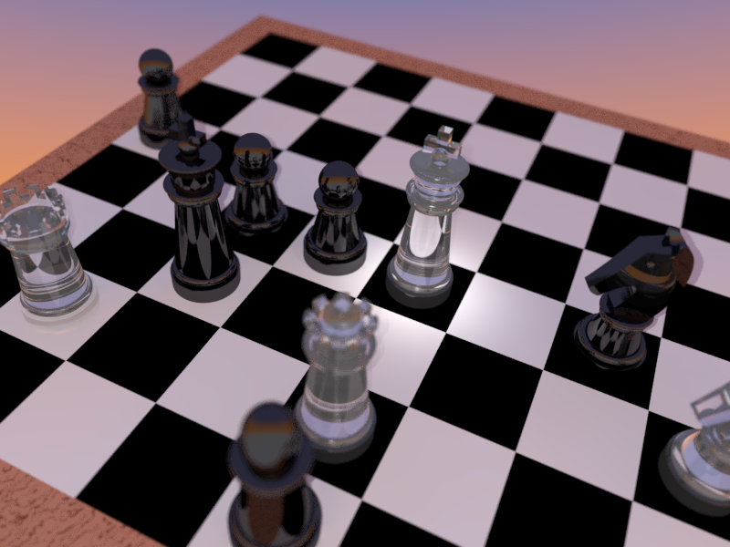

# Examples and templates

For each of the following examples we provide the FreeCAD model, the .pov file as a result of our workbench, the corresponding _user.inc file and the final image.

## Easy examples

### Dice

* [Dice.FCStd](Dice/Dice.FCStd)
* [Dice.ini](Dice/Dice.ini)
* [Dice.pov](Dice/Dice.pov)
* [Dice.png](Dice/Dice.png)
* [Dice_user.inc](Dice/Dice_user.inc)
* [Dice_textures.inc](Dice/Dice_textures.inc)
* [Dice_meshes.inc](Dice/Dice_meshes.inc)

[Download all files as ZIP](./Dice.zip)

### Lens

* [Lens.FCStd](Lens/Lens.FCStd)
* [Lens.ini](Lens/Lens.ini)
* [Lens.pov](Lens/Lens.pov)
* [Lens.png](Lens/Lens.png)
* [Lens_user.inc](Lens/Lens_user.inc)
* [Lens_textures.inc](Lens/Lens_textures.inc)
* [Lens_meshes.inc](Lens/Lens_meshes.inc)

If you want to get the files for the examples with normals on the lens, please download the zip.

[Download all files as ZIP](./Lens.zip)  

## Advanced examples

### Chess

The goal of this example was to demonstrate a realistic rendering.
We know we are not the first who modelled chess pieces.

Because this examples contains many files for every step (the steps are explained in [Realistic.md](../Realistic.md)), we only list the zip here and not all single files.  
[Download all files as ZIP](./Chess/Chess.zip)  

### Architecture (360°VR)

The development of POV-Ray started 30 years ago. At this time virtual reality and VR-glasses were hardly to imagine. But the developers thought about a spherical camera that we can use today for rendering 360° projections. Enjoy standing in the middle of your scene!

[Interactive VR visualization](http://www.barozz.it/vr/fablab_andreas/) (external link)

## Templates

* [Sky](./Templates/SkyWithoutClouds.inc)
* [Sky with clouds](./Templates/SkyWithClouds.inc)
* [Sky and Grass](Templates/GrassWithSky.inc)
* [f-lohmueller - Insert Menu Addons](http://www.f-lohmueller.de/pov_tut/addon/00_Basic_Templates/_index.htm)

[Download all template files](./Templates/Templates.zip)  
