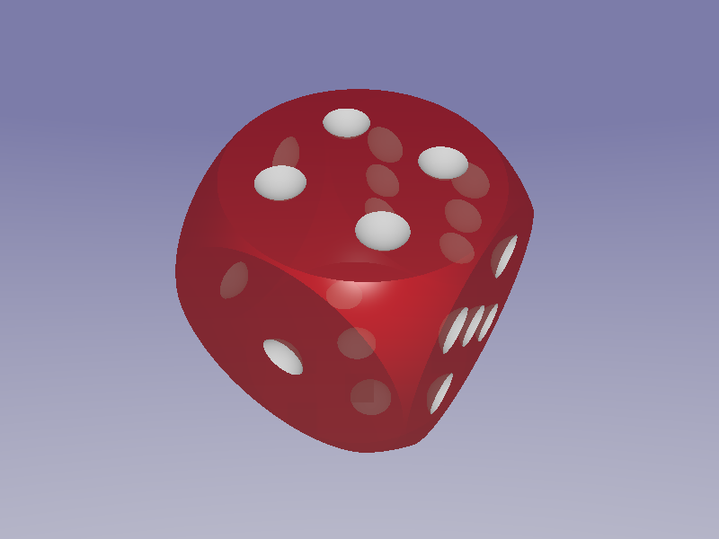
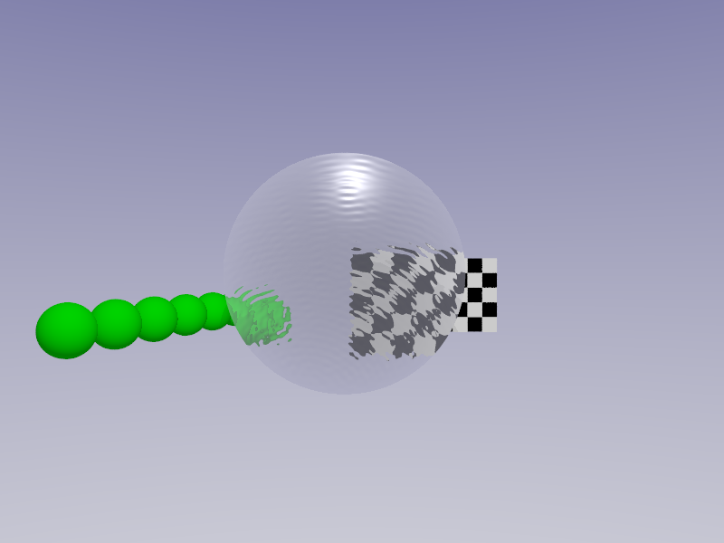
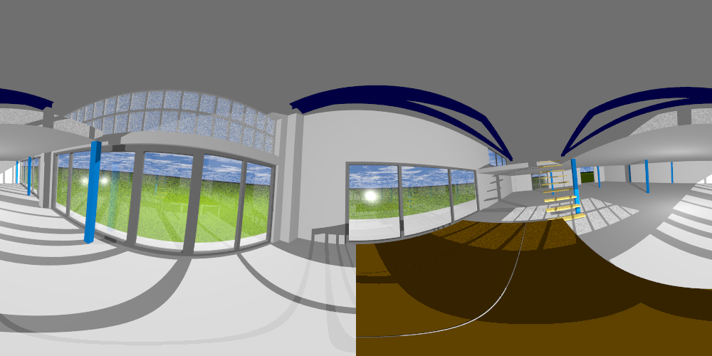

# Examples and templates

For each of the following examples we provide the FreeCAD model, the .pov file as a result of our macro, the corresponding .inc file and the final image.

## Easy examples

### Dice

* [Dice.FCStd](./Dice/Dice.FCStd)  
* [Dice.pov](./Dice/Dice.pov)  
* [Dice.inc](./Dice/Dice.inc)  
* [Dice.png](./Dice/Dice.png)  

[Download all files](./Dice/Dice.zip)

### Lens

* [Lens.FCStd](./Lens/Lens.FCStd)  
* [Lens.pov](./Lens/Lens.pov)  
* [Lens.inc](./Lens/Lens.inc)  
* [Lens.png](./Lens/Lens.png)  

[Download all files](./Lens/Lens.zip)  

## Advanced examples

### Chess

The goal of this example was to demonstrate a realistic rendering.
We know we are not the first who modelled chess pieces.

* [Chess.FCStd](./Chess/Chess.FCStd)  
* [Chess.pov](./Chess/Chess.pov)  
* [Chess.inc](./Chess/Chess.inc)  
* [Chess.png](./Chess/Chess.png)  

[Download all files](./Chess/Chess.zip)  

### Architecture (360°VR)

The developement of POV-Ray started 30 years ago. At this time virtual reality and VR-glasses were hardly to imagine. But the developers thought about a spherical camera that we can use today for rendering 360° projections. Enjoy standing in the middle of your scene!

* [Hall.FCStd](./Hall/Hall.FCStd)  
* [Hall.pov](./Hall/Hall.pov)  
* [Hall.inc](./Hall/Hall.inc)  
* [Hall.png](./Hall/Hall.png)  

[Download all files](./Hall/Hall.zip)  
[Interactive VR visualisation](http://www.barozz.it/vr/fablab_andreas/) (external link)

## Templates

* [Radiosity](./Templates/Radiosity.inc)
* [Area Light](./Templates/AreaLight.inc)
* [Sky](./Templates/SkyWithoutClouds.inc)
* [Sky with clouds](./Templates/SkyWithClouds.inc)
* [f-lohmueller - Insert Menu Addons](http://www.f-lohmueller.de/pov_tut/addon/00_Basic_Templates/_index.htm)

[Download all template files](./Templates/Templates.zip)  
