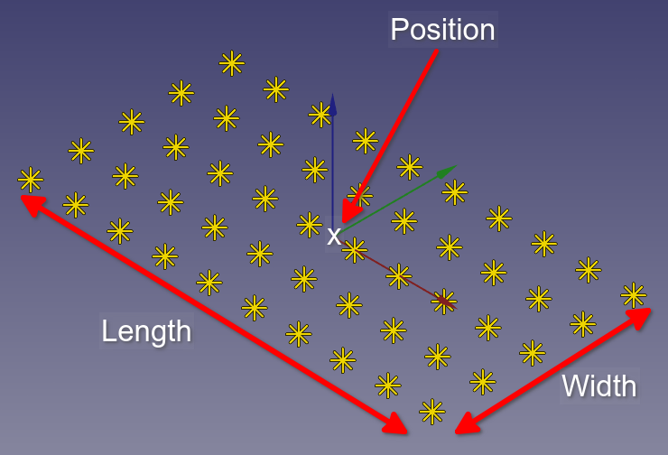
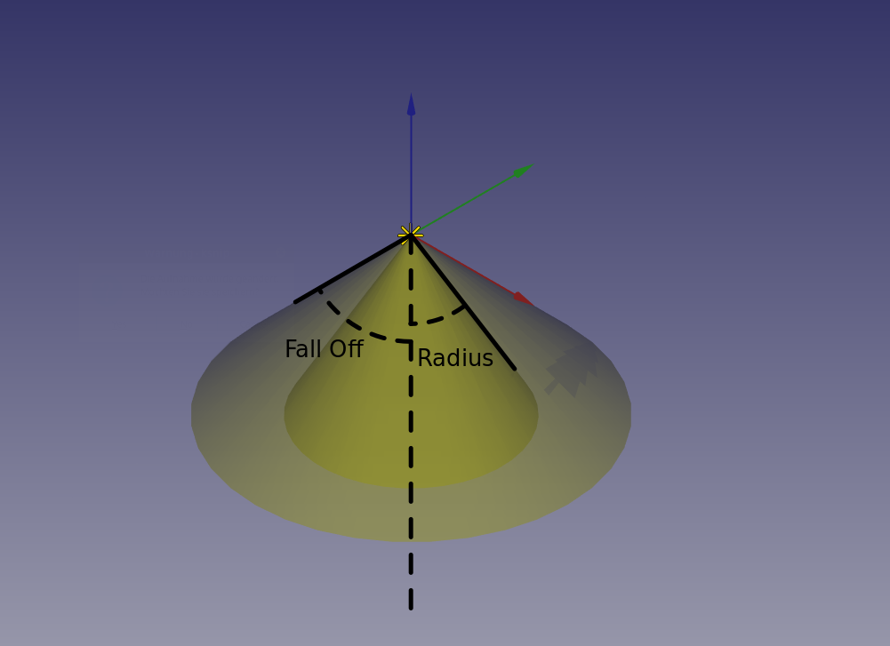

# Light Properties

The light objects have many properties and settings that we explain here.

## General Light Properties for all Lights

* **Color**  
  Here you can define in which color the lights should shine  
  **Tip**: With the color you can also change the intensity. Just change the brightness of the color in the color dialog.

In reality the light intensity decreases with distance. With Fading Distance and Fading Power you can set the specific fading settings (if one of the two values are 0, fading is disabled):

* **Fading Distance**  
  This is the distance from the light to where the light has the intensity of the light without fading.
* **Fading Power**  
  This is the exponent of the decreasing. Higher the value, higher the decreasing.  
    
  **Tip**: A good starting point for fading power is 2.

**Tip**: You can adjust the size of the light icon in the scene in the settings.

## Point Light

The point light has no additional properties (except the placement).

## Area Light

* **Adaptive**  
  Influences the number of ray that will be shot from area light into scene. Setting Adaptive to 1 normally will do a good job. Higher values cause better quality but slower rendering. You can find detailed explanation at [POV-Ray Documentation](http://www.povray.org/documentation/3.7.0/r3_4.html#r3_4_4_1_5)  
* **Area Illumination**  
  Normally area lights only have influence to the shadows. Die direct illumination of surfaces will look like a point light. With area illumination on you can change this.
* **Jitter**  
  if turned on it causes a random movement of each light of the area while rendering. Shadows will get softer.
* **Length**  
  The length (x axis) of the area light.
* **Length Lights**  
  The number of lights along the length axis.
* **Width**  
  The width (y axis) of the area light.
* **Width Lights**  
  The number of lights along the width axis.

## Spot Light

* **Fall Off**  
  The angle of the cone where the light is fading down.
* **Radius**  
  The angle of the cone where the light has the full intensity.
* **Tightness**  
  Exponential softening of the light (higher = sharper).
