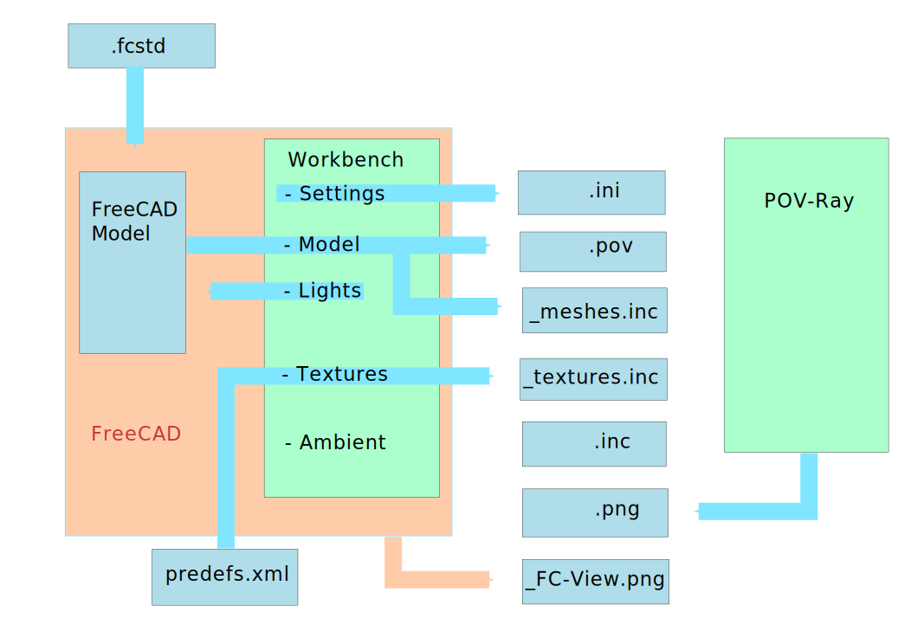

# Project files
Different files will be created if you start the export/rendering.
This is a graphic overview:

## .ini file
The heart of the project.
## .pov file
## _textures.inc
## _meshes.inc
## .inc
## .png
## _FC-View.png 
