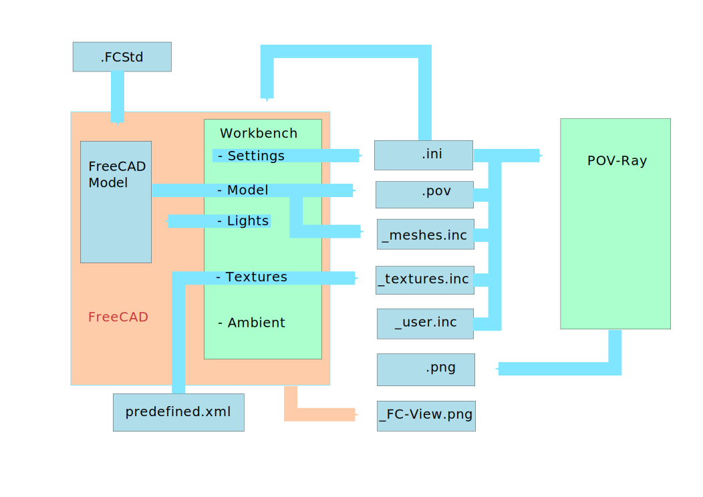

# Explaining the files

Different files will be created if you start the export/rendering.
This is a graphic overview:

## Project files

The following five files contain the rendering project. The main reason for splitting the render project into different files is readability. But ".ini" and "_user.inc" provide special features. 

### .ini file

The heart of the project. Here are also the settings stored that will be read by the workbench to restore the settings.

### .pov file

Here is the converted model stored.

### _textures.inc

Here are all textures defined, that you set in the texture tab.

### _meshes.inc

Because we don't support all objects, some objects need to be converted to meshes. They are stored in this extra file to avoid unreadable pov file.

### _user.inc

Here you can define your own stuff. This file will not be overwritten and it is your access to all the phantastic things of the POV-Ray world. You will find more information at [Power User](PowerUser.md).

## Result of the rendering

### .png

This is the rendered image.

### _FC-View.png

This is a screenshot of the view in FreeCAD but with the same dimensions as the rendered image. It will be directly exported by FreeCAD but only if you check the box in the "Settings" tab of the dialoh.

## Other important files

### .fcstd

No need to mention that this is your FreCAD model. Name and directory of this file are independent of your render project. In case you whant to create more than one rendering from your FreeCAD model we recommend to create a subfolder for each.

### .predefined.xml

This file contains the declarations of the textures that will be shown in the right list of the "texture" tab. You can modify this file to add own textures.