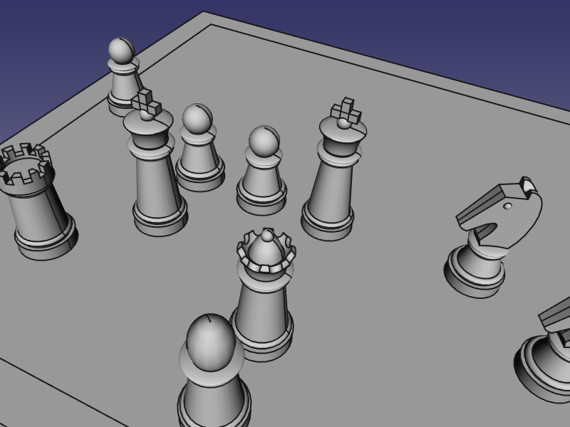
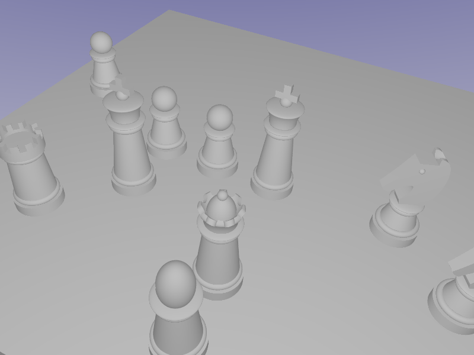
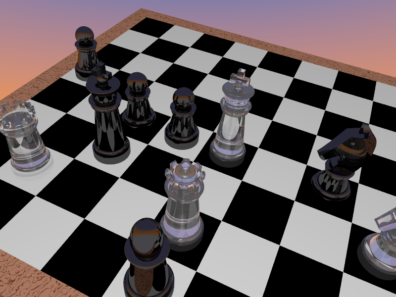
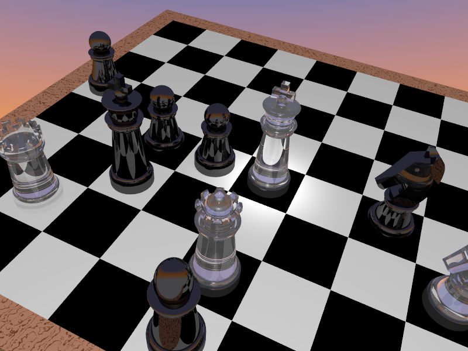
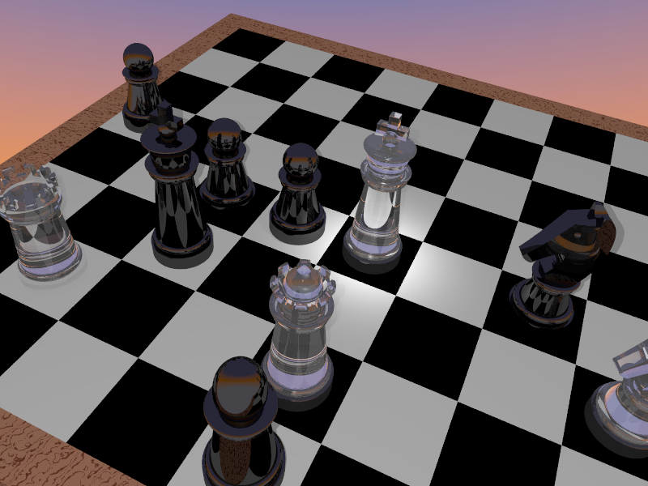
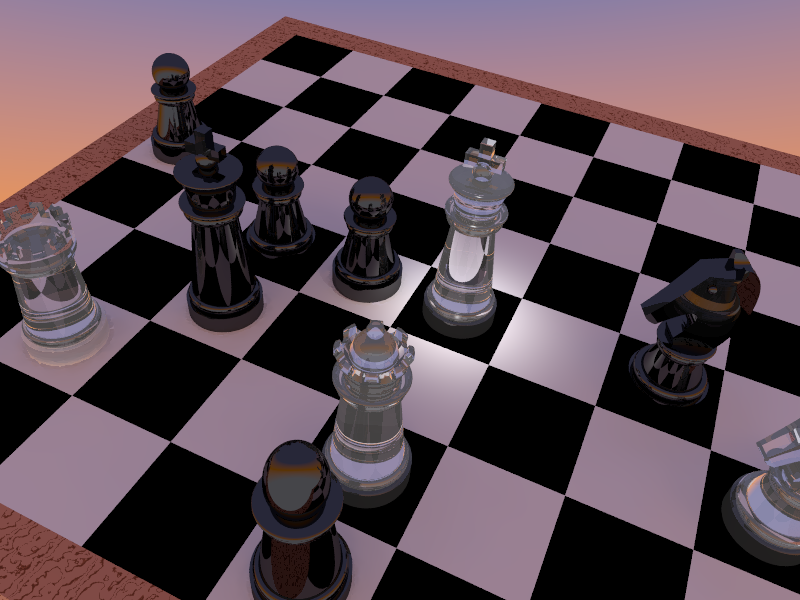

# Rendering a photorealistic Scene - Step by Step

POV-Ray is a very powerful renderer developed in the early 90'ys. It has a mathematical approach not only for description of objects but also for textures an even for the visualization of mathematical functions. So with adding only a few lines you can create great effects.

In the Part Workbench of FreeCAD you can also find objects which can be described by a mathematical function. A sphere for example is described by a centerpoint and a radius. If we combine different mathematical described objects with boolean operations we come to the concept of **CSG** (**C**onstructive **S**olid **G**eometry). The Part Workbench of FreeCAD and the object description language of POV-Ray both share the **CSG** concept.

So our chess example is based on CSG and each solid we have implemented in our macro is at least used once.

## The first rendering

You can download the chess example: [Chess FreeCAD File](Examples/Chess/Chess.FCStd).



If you just render the image without adjusting any settings, you will get this image:



Maybe the result is not very exciting for you. Without any textures and just the basic settings the workbench follows the **WYSIWYG** principle. **W**hat **Y**ou **S**ee (in FreeCAD) **I**s **W**hat **Y**ou **G**et (in POV-Ray). If you checked the "Export FreeCAD view" checkbox in the popup window you can find a second picture with the FreeCAD view in the output directory. Both pictures have the same image size and camera view. But if you look carefully you can see little differences: POV-Ray will not render the outlines of the objects and if you look even closer, the shadows are not the same. It is that way because FreeCAD illuminates each object individually but in POV-Ray we used a single light source at the position of the camera. If there are bigger differences you should check our [Tips & Tricks Section](tipsAndTricks.md).

## Textures

Now let's take the first step into realistic rendering! To add some textures you must open the dialog and change into the texture tab. On the left side of this tab you can see all visible objects of our example. On the right side you can find some predefined textures.
If you want to add a texture to an object choose it in the left list and then the desired texture in the right list. In our example we take "Glass / Crystal glass" for the white pieces and "Stone / Shungit" for the black pieces. There is also a predefined texture called "Checker" to be found under the "Pattern" category. It is important to scale this pattern with factor 20 and translate it 10 units in x and y direction to fit the dimensions of the board.

Another thing we did in the following example: We changed the background color in FreeCAD settings by adding a middle color.

Now start the Rendering again and you will get something like this:



This is a lot better, isn't it? But there is still a lot to improve.

## Lightning

Let's do the next step in realistic rendering. By defining a better lightning you can give the image an atmosphere.  
We introduced the light objects to do this easily. Until now, the only light source in the scene is the FreeCAD light at the same position as the camera. You see, that we defined two lights for you in the model already: one spot light and one point light. Make the spot light visible and render again (don't uncheck the "Export FreeCAD light option"). You should get an image like that:



Like you see, we defined a spot light that points at the white king. To make the rest of the scene darker to set the focus even more on the king, make the point light visible and uncheck the option for exporting the FreeCAD light.



The next step is to adjust the indirect lightning. If you don't know, what indirect lightning (also known as "Global Illumination" or "Radiosity") is, just look in the tab, we explained it directly there. Indirect lightning is an important step for creating realistic images because it calculates the indirect lightning physically correct. Choose the "Normal" option and check "Ambient to 0". Now you will an image like this:


You can also play a bit with the options. To example if you make the global point light invisible, you get this image:



Or you can insert an area light, or something else. Just play around to get the best option. We're sure, that you become addicted.

## Focal Blur

For this step you need the inc file. If you don't know, what the inc file is and how to use it, please visit the [PowerUser](PowerUser.md).

We will define an own camera to add focal blur to the camera. We hope, that we introduce a new camera object soon, where you can define focal blur easily in FreeCAD, but until now, you have to use the user inc for that.

In the inc file we define our own camera:

```pov
camera {
    location <0, 0, 0>
    direction < 0, 1, 0>
    up CamUp
    right CamRight
    rotate CamRotation
    translate CamPosition
    angle 57.82
    focal_point <100,80,10>
    aperture 6
    blur_samples 100
    confidence 0.9
    variance 1/128
}
```

You can see, that we used constants like "CamPosition" instead of the position in numbers. You can use this constants to avoid repositioning the camera every time you changed your view. The constants are defined in the pov file, there you can look to see all constants that we defined.

To learn more about the options, please look here: XXX LINK

## Other stuff

The possibilities are just infinite! To example you could put the chess game into this outdoor scene.
The more you learn about rendering, the Workbench and POV-Ray, the more ideas you will have that you want to realize.
