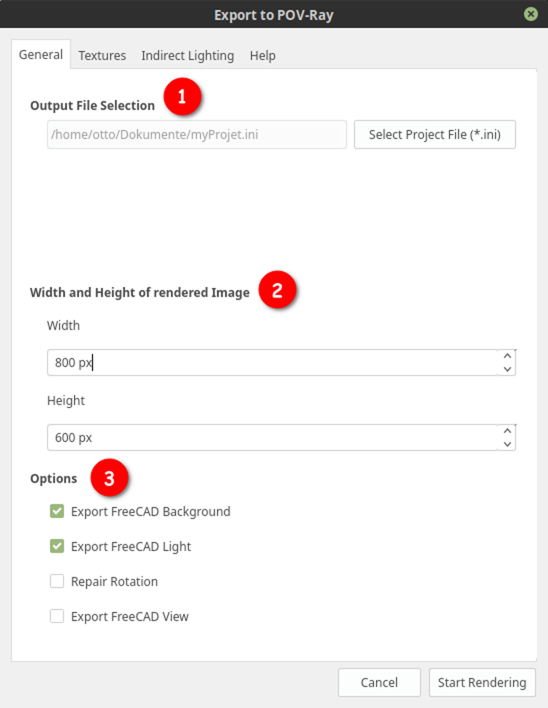
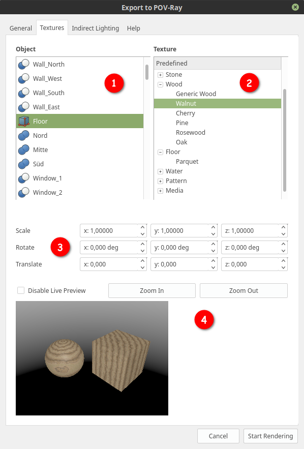

# Settings Dialog

The settings dialog is divided into several tabs. Every tab is for its own section of settings. In the following we go through all tabs and its settings.

## General Tab

1. **File Selection**  
   Here you can choose the the path for your ini file. The ini file is something like a project file. All settings are stored there. If you want to render your project outside FreeCAD directly with POV-Ray, just give POV-Ray this file and you will get the same result as by using the workbench.
2. **Image Size**  
   Here you can set the width & height of the picture. A larger image results in a higher rendering time. A good idea is to start with small values and when you found your optimal settings, then render a larger final picture.
3. **Options**  
   Here are different options you can enable or disable:
   * Export FreeCAD Background  
   Enable this, if you want to have the same background as in the FreeCAD window. You can configure the background in the FreeCAD settings
   * Export FreeCAD Light  
   Enable this, if you want to export the light that is used in FreeCAD. This point light is at the same place as the camera. Enable this option if you have no other lights in your model because without light, your scene will be pretty dark ;-)
   * Repair Rotation  
   Due to a bug in FreeCAD sometimes the rotation values are wrong. If an object in your model seems to be wrong rotated, enable this option.
   * Export FreeCAD View  
   If you enable this option, a screenshot of the current view in the FreeCAD windows will be exported. This can be useful e.g for a comparison between the FreeCAD view and the rendering.

## Texture Tab

 XXX

1. **Objects List**  
   On the left side you have a list of all objects that can get texture / material. Every visible, valid 3D object with a shape color should appear there.
2. **Material List**  
   On the right side you see a list of predefined materials and textures. If you want to add own materials read this tutorial: How to add materials XXX LINK
3. **Geometrical Manipulation**  
   Here you can define geometrical manipulation to the texture:
   * Scale  
   If the texture is too small or too big you can them here in every axis IMAGE
   * Rotate  
   It is possible to rotate materials and textures. This is useful e.g if you want to change the direction of fiber of wood.
   * Translate  
   You can translate materials and textures. This is useful e.g if you want to move the center of wood rings. IMAGE
4. **Preview**  
   To know, how the material looks like, here you get a preview. The cube has a length, width and height of 10mm. You can disable the preview, because the live rendering needs a bit of time on every change. With "Zoom In" and "Zoom Out" you can increase of decrease the preview size (bigger = slower).
