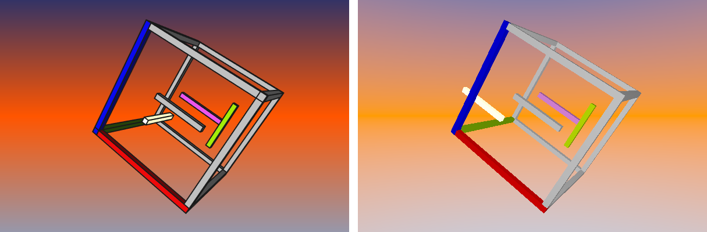
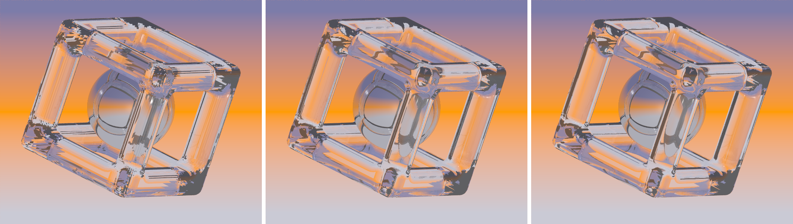

# Limitations, Tips & Tricks

Even if FreeCAD and POV-Ray both support CSG (**C**onstructive **S**olid **G**eometry), we found a lot of differences in the details we had to deal with, while developing this workbench.
So if your rendering doesn't look like you have expected, it may not be a bug, it can also be a compromise to adapt the different concepts of FreeCAD and POV-Ray.

## Table of Contents

- [Limitations, Tips & Tricks](#limitations-tips--tricks)
  - [Table of Contents](#table-of-contents)
  - [The camera](#the-camera)
  - [Background](#background)
  - [Lights](#lights)
  - [Textures and materials](#textures-and-materials)
  - [Object modelling](#object-modelling)
    - [CSG or Mesh](#csg-or-mesh)
    - [Touching surfaces](#touching-surfaces)
    - [Repair rotation](#repair-rotation)
  - [Debugging](#debugging)
  - [Mesh resolution and rendering time](#mesh-resolution-and-rendering-time)

## The camera

Normally you won't have to deal with camera settings. The workbench supports both, orthographic and perspective view. You just choose the view in FreeCAD and the result of the rendering should have the same point of view and viewing angle. There may be some clipping of the borders of the rendered image, if the size of the viewport in FreeCAD isn't exactly the same size you choose in the settings dialog. If you choose the "Export FreeCAD View" option, you will find a image of the FreeCAD view in your output folder with the size of the rendered image. It should match the camera perspective exactly.
If you define your own camera in the .inc file, the workbench will detect this and the camera statement will be commented out in the .pov file. If you want to use special camera types and effects from POV-Ray, but still want to take the camera point of view from FreeCAD, we provide some declarations in the .pov file that you can use in your .inc file:

```pov
#declare CamUp = < 0, 0, 1>;
#declare CamRight = <1.33, 0, 0>;
#declare CamRotation = <-50, -1, 25>;
#declare CamPosition = <120, -25.6932964325, 100>;
```

The example is also the key to the right handedness of the coordinate system we use. While POV-Ray uses a left handed coordinate system, FreeCAD uses a right handed one, which is the standard for CAD programs. In the declaration above you can see the up vector pointing in the z direction and the right vector in the x direction. In POV-Ray examples you will often find the following declaration:

```pov
camera {
    up < 0, 1, 0>
    right< 1.33, 0, 0>
    ...
}
```

So y and z axis are switched and the result ist a left handed coordinate system.
You may ask why right is 1.33. This is the aspect ratio of your image - If the value isn't correct, the rendered image will be stretched or compressed.

If you want to know more about the coordinate system, check out these two links:

[POV-Ray Reference](http://www.povray.org/documentation/3.7.0/r3_4.html#r3_4_2_1_7)

and

[POV-Ray Tutorial](http://www.povray.org/documentation/3.7.0/t2_2.html#t2_2_1_1)

## Background

The Background of the rendered image was a challenge to implement. In FreeCAD you can choose the background colors via the setting menu. You can choose plain color or a gradient of two or three colors. The color you choose in the setting menu is not exactly the same you see in the viewport. FreeCAD darkens the background slightly. So we had to make a decision either to take the original color or the darkened. We took the original - it looks bright and friendly.

The background in POV-Ray is realized by a sky sphere statement. ([POV-Ray Wiki](http://www.povray.org/documentation/3.7.0/r3_4.html#r3_4_3_4)).
It is like an infinite sphere around the scene. The sky sphere is rotated according to the camera rotation. If you use your own camera declaration, the background may tilt. If the tilted background affects your inner balance - turn it off in the settings dialog and declare your own one.

A further problem was the background for the orthographic camera. The sky sphere won't render a color gradient even, if declared. So we placed a patch (internally a polygon) with exactly the size of the orthographic camera view behind the scene. But we also added the sky sphere for realistic reflection on the objects.
This "outside-look" illustrates the "orthographic background":


## Lights

Our workbench supports the three most important types of lights: point lights, area lights and spot lights. If you need more specialized light sources, you have to use the inc file. Read the [Power User Section](PowerUser.md)

By default we defined a light source, which is placed exactly at the position of the camera. If you turn it off and didn't defined a light in the scene or the inc file, only some ambient light will remain. With our default light source the shadows are not so impressing, so we recommend to add other lights to the scene.

## Textures and materials

Our plan was, to create a workbench which is easy to use as possible. At the beginning of the development, changes were only possible about an extra inc file (see the Power Users XXX LINK site to learn how to do that). That was pretty hard to learn for newbies, so we added the texture tab. There we defined textures, you can use in your models.

If you want to add textures, please checkout the correspondent tutorial XXX LINK.

## Object modelling

### CSG or Mesh

The intention of the workbench is to create a model with **C**onstructive **S**olid **G**eometry in FreeCAD, add textures and scene descriptions and render everything with POV-Ray.
So the focus of our development was, to implement a conversion for the solids of the Part Workbench and the boolean operations for constructions.
But FreeCAD is more than a CSG Modeller. To avoid empty renderings, all non implemented features will be converted to meshes. So if you use e.g. fillets or extruded sketches, they will be converted to a mesh before rendering.
FreeCAD, like other CAD software, won't tell you wether an object is a solid or a mesh. And for most of the cases it is not that important to know. But if you do a high resolution rendering of a highly polished sphere, for example you won't like to see a lot of faces. So for a realistic rendering our advice is, to use CSG as long as you can and only switch to meshes, if there is no other possibility.
Another advantage of CSG is, that it needs less memory than the mesh representation of the same object. One reason for developing this workbench was the lack of clarity of the .pov files created by the Raytracing Workbench. Because we don't like any mess-up in the .pov file we put all meshes in an include file and leave only the matching identifiers in the .pov file. On the bottom of this site you can find more information about [Mesh resolution and rendering time](#mesh-resolution-and-rendering-time)

### Touching surfaces

In reality there is always a gap between things touching each other. If you put a glass on a table, for example, the total reflections on the inner side behaves like in air. If we model things that touch each other, we tend to give the surface vectors the same values. This will lead to confusing effects.
In the following example we create two boxes from exactly the same size sitting on a plane. The z-Position of all three objects is zero. On the left side you can see that your graphic processor gets confused because he doesn't know if he should render the red or the grey box in the overlapping area. Never mind - If we cut the two boxes, everything seems to be OK, but ...

  

...if we render this scene with POV-Ray, including some materials, we can see some funny effects: In the overlapping area a thin holey layer remains. What you can also see, is a dotted area where the bottom of the glassblock touches the checkered plane. If you want to avoid these effects, leave a gap. In the right picture the plane is 0,01mm below zero and the red box is a little bit bigger then the glass block. So now the rendering on the right side is the same as our FreeCAD model.

  

### Repair rotation

While developing this workbench, we had to learn about the different rotation systems. FreeCAD normally uses the "axis / angle" system and for POV-Ray "Euler Rotation" is the standard.
FreeCAD provides some functions to convert between the systems. Unfortunately one of these functions has a bug, so sometimes a wrong rotation will appear in the rendering as you can see in the following example. If you find wrong rotated objects in your renderings, just activate the "Repair rotation" checkbox and the rotation will be corrected by a workaround.



## Debugging

There are several ways to get debugging information if an error occurs. First it is useful to activate the console output window. The workbench will provide some statistical information while converting the scene into a POV-Ray file. If nothing is rendered you should localize the error. A bug in our workbench will lead to an empty .pov file and incomplete console output. While a POV-Ray Error appears you will see a popup window with an error message. In most cases the error message will tell you about a wrong syntax in your include file so you have a chance to correct it. The POV-Ray error message will be also written into a file in the output directory. If you want to see the complete debugging information from POV-Ray open a console window and start the rendering from the command line.

```pov
povray myPovFile.ini
```

You will find more about command line options in the [POV-Ray wiki](http://www.povray.org/documentation/3.7.0/r3_2.html#r3_2)

If you think you found a bug in our workbench we would be happy if you report it to us.

## Mesh resolution and rendering time

The usage of non CSG objects can slow down the exporting process and result in a big mesh file. In this case you FreeCAD freezes until the calculation of the mesh is finished. You can influence the resolution of the mesh by changing the values of angular deflection an deviation in the objects view properties. The default values are 28,5° for Angular deflection and 0.5 for deviation.
In the following example we increase the resolution of the mesh by changing these values.

| Angular Deflection | Deviation | Creation of mesh | Mesh file size |
|-------------------:|----------:|-----------------:|--------------:|
| 28,5°              | 0,5       | 2s               | 295 KB        |
| 10,0°              | 0,1       | 57s              | 2,1 MB        |
|  5,0°              | 0,1       | 15min            | 7,2 MB        |

Increasing mesh resolution from left to right:



A slow rendering can also be a result of some POV-Ray options like radiosity or a complex scene. In this cases our advice is to start with small image sizes and render the high resolution image at the end.
