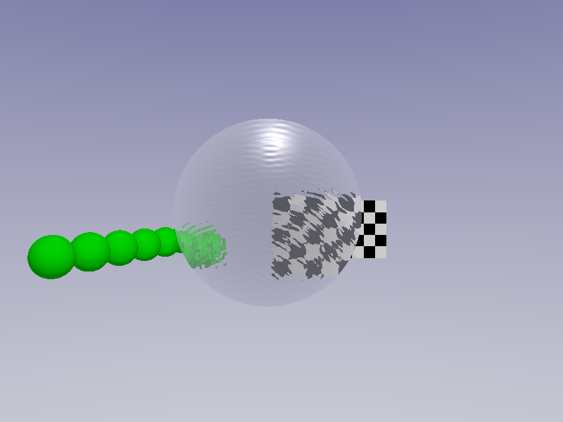
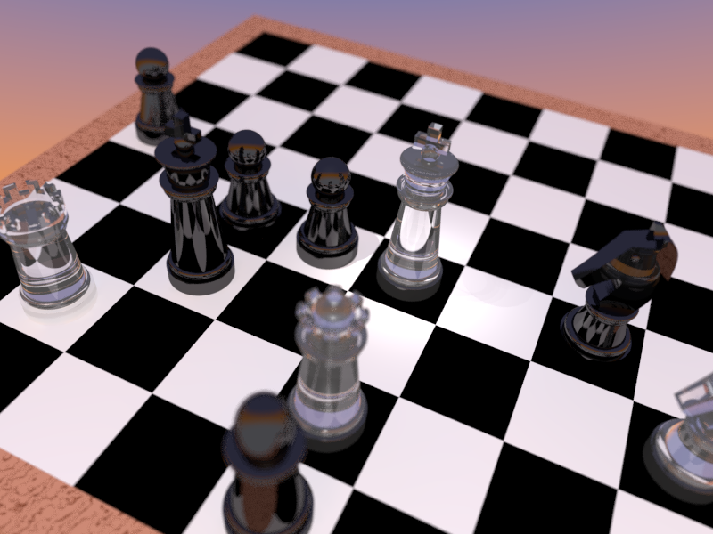

# Examples and templates

For each of the following examples we provide the FreeCAD model, the .pov file as a result of our macro, the corresponding .inc file and the final image.

## Easy examples

### Dice

* [Dice.fcstd](../Examples/Dice/Dice.fcstd)  
* [Dice.pov](../Examples/Dice/Dice.pov)  
* [Dice.inc](../Examples/Dice/Dice.inc)  
* [Dice.png](../Examples/Dice/Dice.png)  

[Download all files](../Examples/Dice/Dice.zip) 

### Lens

* [Lens.fcstd](../Examples/Lens/withRipples/Lens.fcstd)  
* [Lens.pov](../Examples/Lens/withRipples/Lens.pov)  
* [Lens.inc](../Examples/Lens/withRipples/Lens.inc)  
* [Lens.png](../Examples/Lens/withRipples/Lens.png)  

[Download all files](../Examples/Lens/withRipples/Lens.zip)  

## Advanced examples

### Chess

The goal of this example was to demonstrate a realistic rendering.
We know we are not the first who modelled chess pieces.

* [Chess.fcstd](../Examples/Chess/Chess.fcstd)  
* [Chess.pov](../Examples/Chess/Chess.pov)  
* [Chess.inc](../Examples/Chess/Chess.inc)  
* [Chess.png](../Examples/Chess/Chess.png)  

[Download all files](../Examples/Chess/Chess.zip)  

### Architecture (360°VR)

The developement of POV-Ray started 30 years ago. At this time virtual reality and VR-glasses were hardly to imagine. But the developers thought about a spherical camera that we can use today for rendering 360° projections. Enjoy standing in the middle of your scene!

* [Hall.fcstd](../Examples/Hall/Hall.fcstd)  
* [Hall.pov](../Examples/Hall/Hall.pov)  
* [Hall.inc](../Examples/Hall/Hall.inc)  
* [Hall.png](../Examples/Hall/Hall.png)  

[Download all files](../Examples/Hall/Hall.zip)  
[Interactive VR visualisation](http://www.barozz.it/vr/fablab_andreas/) (external link)

## Templates

* [Radiosity](../Examples/Templates/Radiosity.inc)
* [Area Light](../Examples/Templates/AreaLight.inc)
* [Sky](../Examples/Templates/SkyWithoutClouds.inc)
* [Sky with clouds](../Examples/Templates/SkyWithClouds.inc)  

[Download all template files](../Examples/Templates/Templates.zip)  
