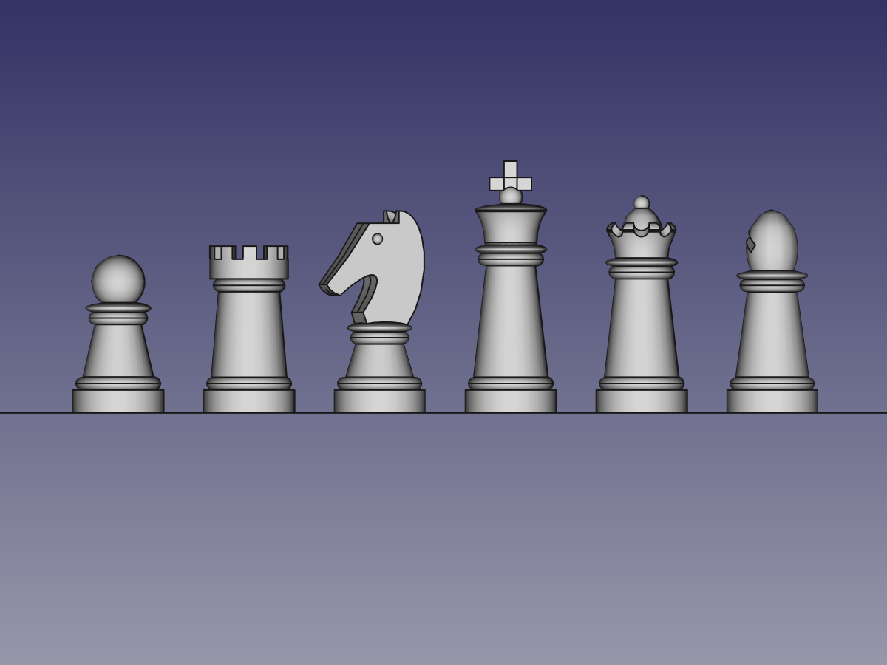
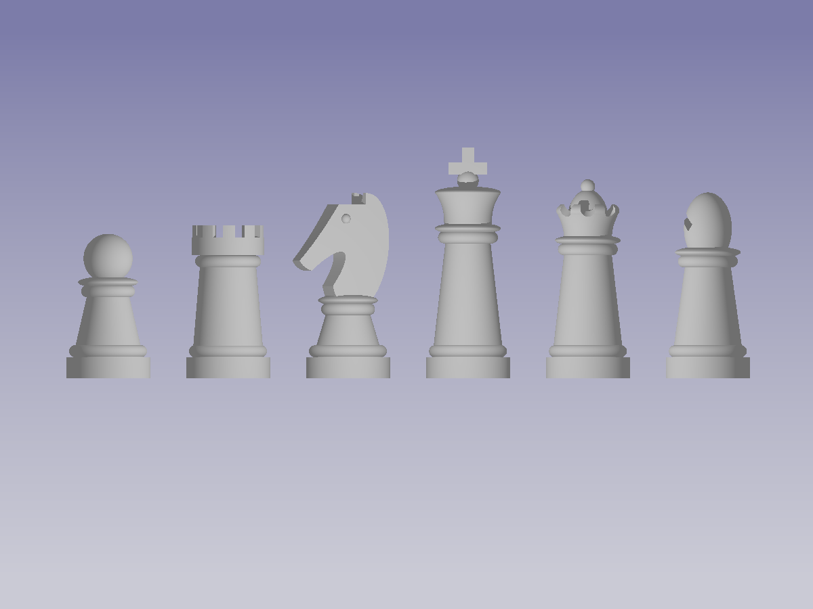
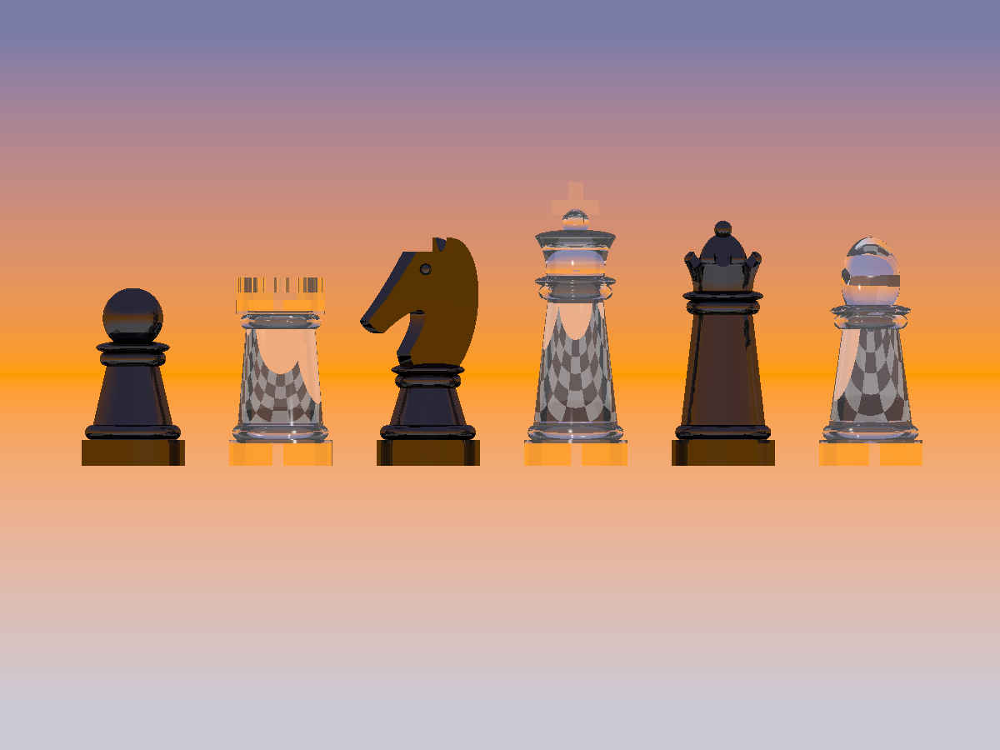
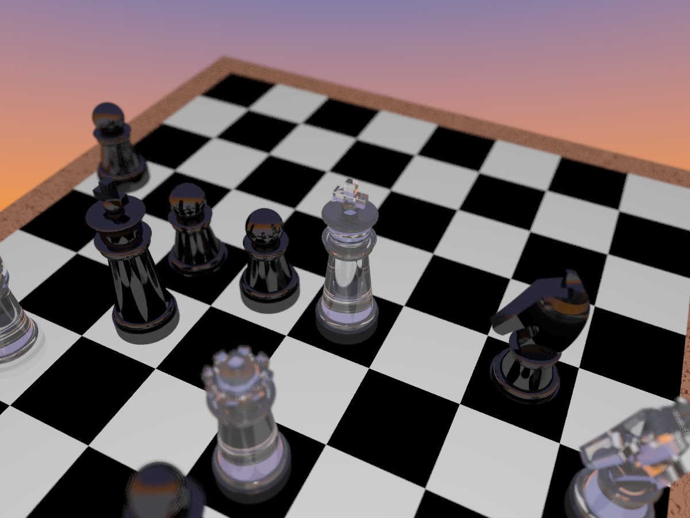
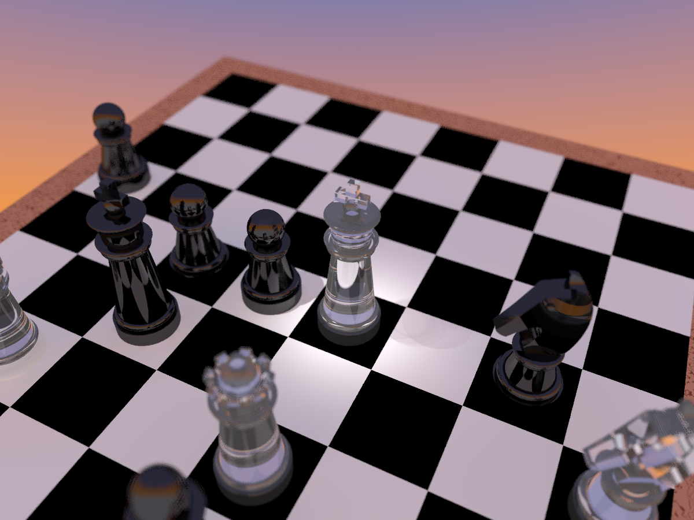

# Rendering a photorealistic Scene - Step by Step

POV-Ray is a very powerful renderer developed in the early 90ies. It has a mathematical approach not only for description of objects but also for textures an even for the visualisation of mathematical functions. So with adding only a few lines you can create great effects.

In the part workbench of FreeCAD you can also find objects which can be described by a mathematical function. A sphere for example is described by a centerpoint and a radius. If we combine different mathematical described objects with boolean operations we come to the concept of **CSG** (**C**onstructive **S**olid **G**eometry). The part workbench of FreeCAD and the object description language of POV-Ray both share the **CSG** concept.

So our chess example is based on CSG and each solid we have implemented in our macro is used once at minimum.



You can download the chess example: [Chess FreeCAD File](../Examples/Chess/ChessPieces.FCStd).  
If you start the macro a popup window appears where you can choose a filename for the output file and the size of the picture to be rendered.
Be shure your pathname contains no spaces because POV-Ray can't deal with this.
Now start the rendering by clicking OK. If POV-Ray is installed correct this image should appear:
To close the window with the rendered image click in the middle of the image!



Maybe the result is not very exciting for you. Without any additional file the macro follws the **WYSIWYG** principle. **W**hat **Y**ou **S**ee (in FreeCAD) **I**s **W**hat **Y**ou **G**et (in POV-Ray). If you checked the "Export FreeCAD view" checkbox in the popup window you can find a second picture with the FreeCAD view in the output directory. Both pictures have the same image size and camera view. But if you look carefully you can see litte differences: POV-Ray will not render the outlines of the objects and if you look more careful - the shadows are not the same. This is because FreeCAD illuminates each object for its own but in POV-Ray we used a single lightsource at the position of the camera. If there are bigger differences you should check our [Tips & Tricks Section](XXX).

Now lets take the first step into realistic rendering! To add some textures we need a include file in the same directory of our .pov output file. To be recognized by our macro its name must be the same as the POV-Ray file but with the .inc extension. If you choose Chess01.pov for your output file the corresponding texture file is Chess01.inc
Before you create your own textures take a look at our example which can be downloaded [Chess inc File](../Examples/Chess/ChessTextures.inc).
Just put it in the right folder, rename it and start the macro again. The result should be like this:



So what we did is: We changed the background color in FreeCAD via the settings (Did you know you can choose a middle color in the FreeCAD settings?). In the .inc file we defined just three textures. The glass for the white figures is a predefined material in POV-Ray, for the black figures we defined our own texture and the board has a simple checker pattern which had to be scaled to match the size of our board.

If you create your own textures be sure to use the right syntax. Replace the "xxx" in the following declaration with te object name from the object tree in FreeCAD:

```
#declare xxx_material = material { }
```

Put your material declaration inside the brackets. Be aware of the hierarchy of material declaration. We only provide `material { }` in our macro because it is toplevel of all other statements like texture, pigment, finish, pattern etc. POVray has an excellent documentation, so you will find further information in the [POVray wiki](http://www.povray.org/documentation/3.7.0/r3_4.html#r3_4_5_5_3).
Ignoring the material hierarchy will lead to a POV-Ray error and nothing will be rendered. How to get the console output from POV-Ray for debugging see the [Tips & Tricks Section](XXX).

Now let's try to add more reality to the chess Example. You can download another FreeCAD file for a gaming scene and a corresponding include file:

[ChessGame.FCstd](../Examples/Chess/ChessGame.FCstd)  
[ChessFokalBlur.inc](../Examples/Chess/ChessFokalBlur.inc)

The rendering will look like this:



In the example we defined our own camera with a focal blur statement so our scene looks more like a photo. If you put your own camara in the include file the macro will detect it and the camera statement in the .pov file will be outcommented. But you can still use camera position and rotation of the FreeCAD viewport because we provide them as declarations. For special effects POV-Ray provides much more camara types then FreeCAD and they can be modified. So lots of fun waiting for you.

In the last example we added a second light source. It is a spotlight that turns the fokus on the white king - maybe he is in danger - what do you think?
We also added some radiosity for more realistic light. There are different types of lightsources and lightning effects availible.

Download the advanced lightning example [here](../Examples/Chess/ChessLightning.inc)




If you have not so much konwledge about POVray, we created a few templates for you. You can find them in the [Template Folder](../Examples/Templates/).
