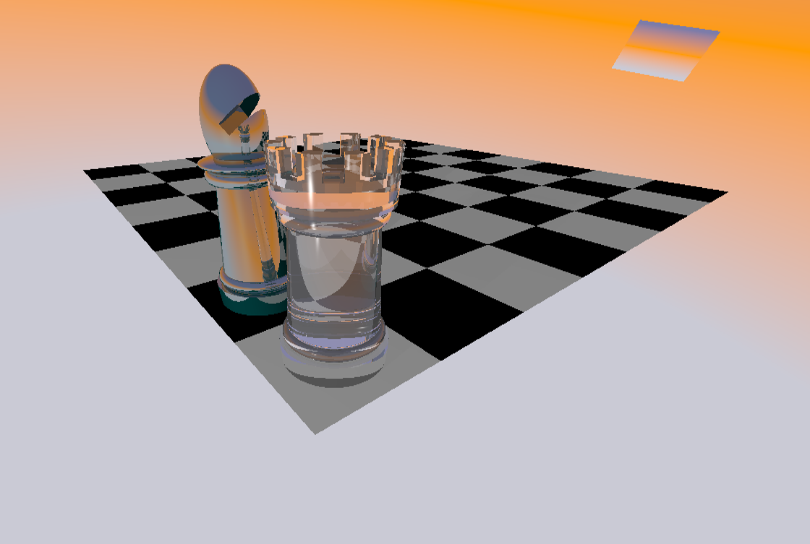
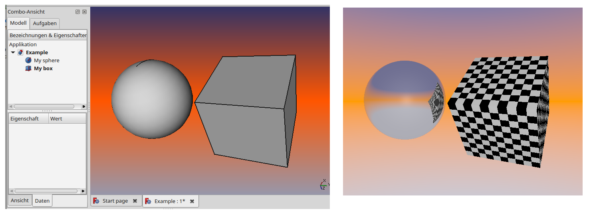
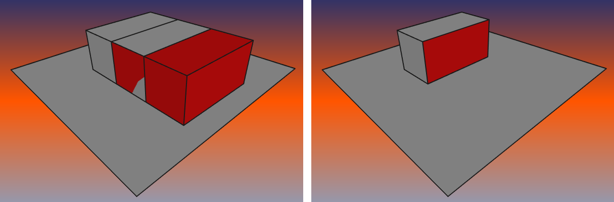
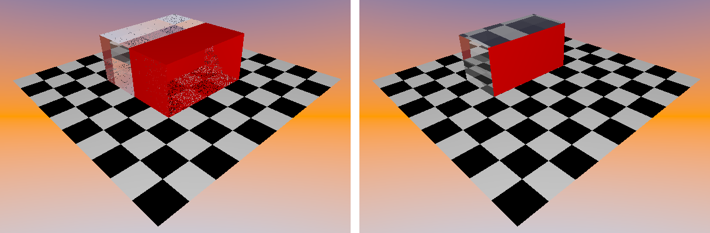

## Table of Contents
- [Limitations, Tips & Tricks](#limitations-tips--tricks)
- [Table of Contents](#table-of-contents)
- [The camera](#the-camera)
- [Background](#background)
- [Lights](#lights)
- [Textures and materials](#textures-and-materials)
- [Object modelling](#object-modelling)
    - [CSG or Mesh?](#csg-or-mesh?)
    - [Touching surfaces](#touching-surfaces)
    - [Repair rotation](#repair-rotation)
- [Debugging](#debugging)

## Limitations, Tips & Tricks

Even if FreeCAD an POV-Ray both support CSG **C**onstructive **S**olid **G**eometry we found a lot of differences in the details we had to deal with, while developing this macro.
So if your rendering looks not like you expected it may not be a bug, it can also be a compromise to adapt the different concepts of FreeCAD and POV-Ray.

## The camera

Normally you won't have to deal with camera settings. The macro supports both, orthographic and perspective view. You just choose the view in FreeCAD and the result of the rendering should have the same point of view and viewing angle. There may be some clipping of the borders of the rendered image if the size of the viewport in FreeCAD isn't exacly the same size you choose in the macro popup. If you choose the "Export FreeCAD View" option you will find a image of the FreeCAD view in your output folder with the size of the rendered image. It should match the camera perspective exactly.
If you define your own camera in the .inc file the macro will detect this and the camera statement will be outcommented in the .pov file. If you want to use special camera types and effects from POV-Ray but still want to take the camera point of view from FreeCAD we provide some declarations in the .pov file that you can use in your .inc file:
```
#declare CamUp = < 0, 0, 1>;
#declare CamRight = <1.33, 0, 0>;
#declare CamRotation = <-50, -1, 25>;
#declare CamPosition = <120, -25.6932964325, 100>;
```
The example is also the key to the right handedness of the coordinate system we use. While POV-Ray uses a left handed coordinate system FreeCAD like many other CAD Programs uses a right handed one. In the above declaration you can see the up vector pointing in the z direction and the right vector in the x direction. In POV-Ray examles you will often find the following declaration:
```
camera{
    up < 0, 1, 0>
    right< 1.33, 0, 0>
    ...
}
```
So y and z axis are swaped and the result ist a left handed coordinate system.
You may ask why right is 1.33. This is the aspect ratio of your image - If the value ist not correct the rendered image will be streched or compressed.

If you want to know more about the coordinate system see:

[POV-Ray Reference](http://www.povray.org/documentation/3.7.0/r3_4.html#r3_4_2_1_7)

and

[POV-Ray Tutorial](http://www.povray.org/documentation/3.7.0/t2_2.html#t2_2_1_1)

## Background

The Background of the rendered image was a challenge to implement. In FreeCAD you can choose the background colors via the settings menu. You can choose plain color or a gradient of two or three colors. The color you choose in the settings menu is not exactly the same you see in the viewport. FreeCAD darkens the Background slightly. So we had to make a decision either to take the original color or the darkened. We took the original - it looks bright and friendly.

The background in POV-Ray is realised by a skysphere statement. See [POV-Ray Wiki](http://www.povray.org/documentation/3.7.0/r3_4.html#r3_4_3_4).
It is like an infinite sphere around the scene. The skysphere is rotated according to the camera rotation. If you use your own camera declaration the background may tilt. If the tilted background affects your inner balance - switch it of in the macro dialog and declare your own.

A further problem was the background for the orthographic camera. The skysphere won't render a color gradient even if declared. So we placed a patch with exactly the size of the orthographic camera view behind the scene. But we also add the skysphere for realistic reflection on the objects.
This "look from outside" illustrates the "orthographic background":



## Lights

By default we defined a lightsource which is placed exactly at the position of the camera. If you switch it of some ambient light will remain. With our default lightsource the shadows are not so impressing. You can define as many lights as you want from different types in the .inc file. For more information about light see [POV-Ray Wiki](http://www.povray.org/documentation/3.7.0/r3_4.html#r3_4_4).  
Alternative we made a template for you (in this example an area light with soft shadows): [Area Light Template](../Examples/Templates/AreaLight.inc)

## Textures and materials

To describe all surface and interior modifiying features of POV-Ray would burst this chapter. Our advice for the workflow is first to model your objects in FreeCAD without changing any colors and in a second step add textures and materials to the .inc file. The link from a FreeCAD object to its material in the .inc file is the name of the object in the FreeCAD object tree better called the object label.
If you want to apply a material to an object you add a declaration to the .inc file with the following syntax:

```
#declare ObjectLabel_material = material { }
```
This is the .inc file for the following example:

```
#include "metals.inc"

#declare My_Sphere_material = material{
    texture {
        pigment { P_Chrome1 }
        finish { F_MetalD }
    }
}

#declare My_Box_material = material{
    texture {
        checker
        texture { pigment{ color rgb <0,0,0> }}
        texture { pigment{ color rgb <1,1,1> }}
    }
}

```



The first thing our macro will do is to look for a .inc file with the same name as the .pov file in the same folder.
For example the corresponding .inc file for "example.pov" is "example.inc".
If the .inc file exsists it will be included in the .pov file with the following line:

```
#include "example.inc"

```
In the next step the macro will look for material declarations in the .inc file matching the object labels.
If found the FreeCAD textures in the .pov file will be replaced:


```
material {My_Sphere_material}
```
Because POV-Ray can't deal with spaces and special chars we use a replacement function.
If you have problems with object labels just lookup the .pov file - every object has a outcommented header with the correct label.
Everything put together this is how the sphere declaration in the .pov file looks like:

```
//----- My_Sphere -----
sphere { <0, 0, 0> 5
    translate <0.0, -6.0, 0.0>

    material {My_Sphere_material}

}
```
It is important to take care of the material hierarchie. The macro looks only for the material statement to be replaced. In our example we use a predefined pigment and finish for the sphere. Both are two levels below below the material statement. And they need an additional include file. Put this line at the top of the inc file to include the file:
```
"metals.inc"
```
For a wrong syntax a error message will pop up where you can find some debugging information.
Together with the [POV-Ray Wiki](http://www.povray.org/documentation/3.7.0/r3_4.html#r3_4_6)  you will be able to create any texture you want.

## Object modelling

### CSG or Mesh?

The intention of the macro is to create a model with **C**onstructive **S**olid **G**eometry in FreeCAD, add textures and scene descriptions and render everything with POV-Ray.
So the focus of our developement was to implement a conversion for the solids of the Part Workbench and the boolean operations for constructions.
But FreeCAD is more than a CSG Modeller. To avoid empty renderings all non implemented features will be converted to meshes. So if you use fillets for example or extrued sketches they will be converted to a mesh before rendering.
FreeCAD, like other CAD software, won't tell you wether an object is a solid or a mesh. And for most cases it is not so important to know. But if you do a high resoloution rendering of a highly polished sphere for example you would not like to see a lot of faces. So for a realistic rendering our advice is to use CSG as long as you can and only switch to meshes if there is no other way.
An other advantage of CSG is that it needs less memory than the mesh representation of the same object. One reason for developing this macro was the unclearness of the .pov files created by the Raytracing Workbench. Because we don't like any mess-up in the .pov file we put all meshes in a include file and only leave the matching identifiers in the .pov file

### Touching surfaces

In reality there is alwas a gap between things that touch each other. If you put a glass on a table for example the total reflections on the inner side behaves like in air. If we model things that touch each other we tend to give the surface vectors the same values. This will lead to confusing effects.
In the following example we create two boxes from exactly the same size sitting on a plane. The z-Position of all three objects is zero. On the left side you can see that your graphic processor gets confused because he doesn't know if he should render the red or the grey box in the overlapping area. Never mind - If we cut the two boxes everything seems to be OK, but ...

  

if we render this scene with POV-Ray including some materials we can see some funny effects. In the overlapping area a thin holey layer remains. What you can also see is a dotted area where the bottom of the glassblock touches the checkered plane. If you want to avoid these effects leave a gap. In the right picture the plane is 0,01mm below zero and the red box is a little bit bigger then the glass block. So now the rendering on the right side is the same like our FreeCAD model.

  

### Repair rotation

## Debugging


* For side views, try the orthographic view. But for a non side view, don't use the orthographic view. That doesn't look realistic
* Try to get a more realistic image: [Rendering a photorealistic Scene - Step by Step](realistic.md)
* If you have a big scene with a lot of objects and many materials with light refraction, try a little size of the image first, because then you not must wait for a long time.
