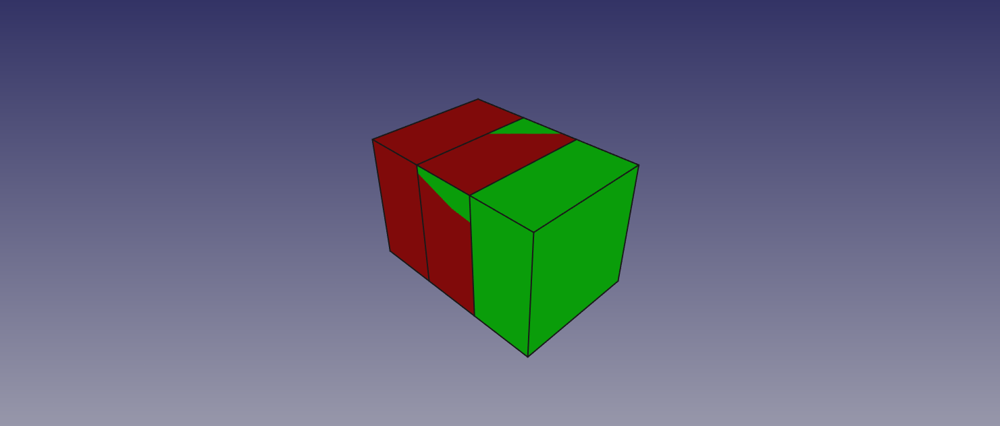
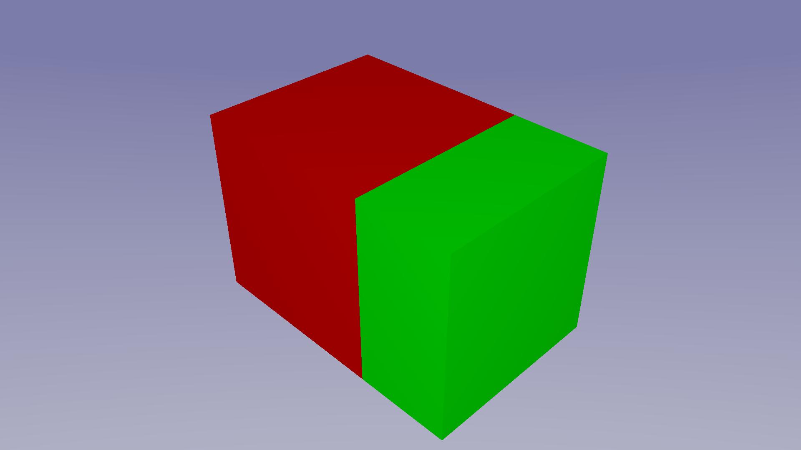
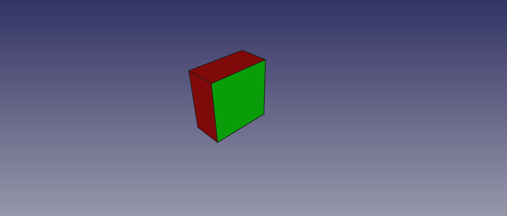
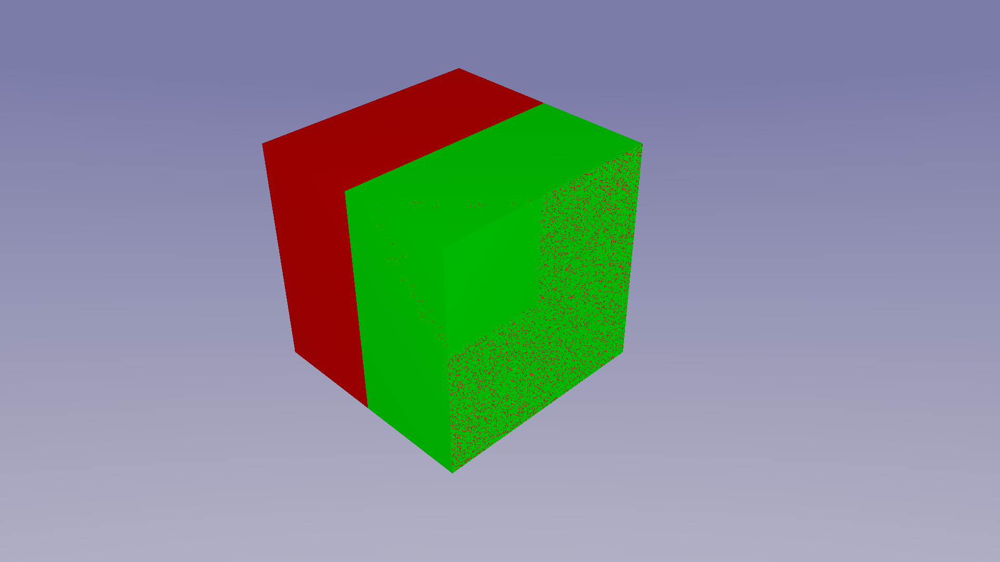

# Limitations, Tips & Tricks

Even if FreeCAD an POV-Ray both support Constructive Solid Geometry we found a lot of differences in the details we had to deal with, while developing this macro.
So if your rendering looks not like you expected it may not be a bug, it can also be a compromise to adapt the different concepts of FreeCAD and POV-Ray.

## The camera

Normally you wont have to deal with camera settings. The macro both supports orthographic and perspective view. You just choose the view in FreeCAD and the result of the rendering should have the same point of view and viewing angle. There may be some clipping of the borders of the rendered image if the size of the viewport in FreeCAD isn't exacly the same size you choose in the Macro popup. If you choose the "Export FreeCAD View" option you will find a image of the FreeCAD view in your output folder with the size of the rendered image. It should match the camera perspective exactly.
If you define your own camera in the .inc file the macro will detect this and the camera statement will be outcommented in the .pov file. If you want to use special camera types and effects from POV-Ray but still want to take the camera point of view from FreeCAD we provide some declarations in the .pov file that you can use in your .inc file:
```
#declare CamUp = < 0, 0, 1>;
#declare CamRight = <1.33, 0, 0>;
#declare CamRotation = <-50, -1, 25>;
#declare CamPosition = <120, -25.6932964325, 100>;
```
The example is also the key to the handedness of the coordinate system we use. While POV-Ray uses a left handed coordinate system FreeCAD like many other CAD Programs uses a right handed one. In th e above declaration you can see the up vector pointing in the z direction and the right vector in the x direction. In POV-Ray examles you will often find the following declaration:
```
camera{
    up < 0, 1, 0>
    right< 1.33, 0, 0>
    ...
    }
```
So y and z axis are swaped and the result ist a left handed coordinate system.
You may ask why right is 1.33. This ist aspect ratio of your image - If the value ist not correct the rendered image will be streched.

If you want to know more about the coordinate system see:

[POV-Ray Reference](http://www.povray.org/documentation/3.7.0/r3_4.html#r3_4_2_1_7)

and

[POV-Ray Tutorial](http://www.povray.org/documentation/3.7.0/t2_2.html#t2_2_1_1)

## Background


* You can change the background of FreeCAD under Edit/Preferences/Display/Colors/Background Color. You can also add a middle color.
* For side views, try the orthographic view. But for a non side view, don't use the orthographic view. That doesn't look realistic
* Try to get a more realistic image: [Rendering a photorealistic Scene - Step by Step](realistic.md)
* If you have a big scene with a lot of objects and many materials with light refraction, try a little size of the image first, because then you not must wait for a long time.
* If you create a cut with two touching surfaces in FreeCAD, nothing remains. With POVray, however, an infinitely thin layer remains:

  
  

  Then you cut the two boxes.

  
  

  To avoid this, the part to be removed should be slightly larger than the other part.
